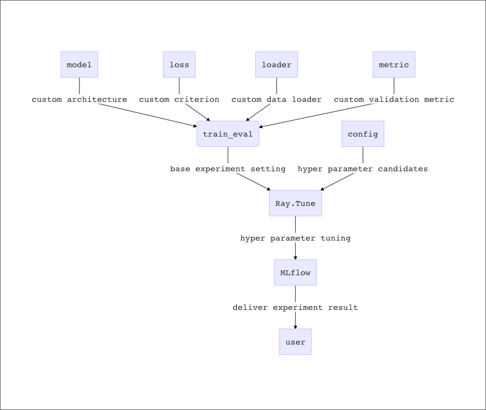

# Autorch

Autorch is an open source library for automated machine learning hyper parameter tuning using PyTorch. The ultimate goal of this tool is to provide convenient logging & status function about configuration which user set hyper parameters.

## Requirements

Ray, MLflow, python >= 3.6, pytorch==0.4.0, keras, tensorflow

## Workflow



## How to use

#### 1. Component implementation

In Autorch, user have to implement their own data loader, loss function and model architecture. But It can be easily found in many examples such as MNIST or Cifar10 example in this repository.

| Components        | Location / Role                                              |
| ----------------- | ------------------------------------------------------------ |
| Model archtecture | folder in 'model' / implement model architecture             |
| Loss function     | folder in 'loss' / implment criterion to calculate back propagation |
| Data loader       | folder in 'loader' / impelement data ETL and augmentation logic |
| Metric            | folder in 'metric' / implement model performance measure function |

After these 3 components are implemented(or re-use other one), user have to import and set these implementaion on **train_eval.py**

```python
#set the learning config
config = configparser.ConfigParser()
config.read('config.ini')
config = config['cifar10'] #section config load

###set custom model & data_loader & criterion & metric classes
from model import cifar10_classification_model
from loader import cifar10_image_loader
from metric.Metric import Accuracy, MSE

#set the model
model = cifar10_classification_model.Cifar10_classifier()
#set the dataLoader
dataLoader = cifar10_image_loader.Cifar10ImageLoader(data_dir=config['data_dir'], batch_size=int(config['batch_size']))
#set the loss function(if you implement your own, import that custom loss class)
criterion = nn.CrossEntropyLoss()
customMetric = Accuracy
##############################################################
```

#### 2. Setting experiment configuration

##### 2-1. Applying custom metric to test_epoch module

After setting custom metric for measuring model performance, user have to apply that function to **test_epoch** function.
Below is a example of classification accuracy

```python
#apply custom metric(in this case, Accuracy)
predictions += list(output.data.max(1)[1].cpu().numpy())    # get the index of the max log-probability
answers += list(target.data.cpu().numpy())

test_accuracy = customMetric.evaluate(predictions, answers)
```

##### 2-2. Setting configuration to config.ini file

After importing loader, model and criterion implementation, user have to set their specific experiment condition. User can write their experiment condition to **config.ini**. 

Here is Instruction of variety of variables in **config.ini**. Please refer example file.

| Variable Name            | Role                                                         |
| ------------------------ | ------------------------------------------------------------ |
| [cifar10]                | Configuration sectio name(it can be re-name by user, if there are several configuration in config.ini file, it can be splitter by this section name) |
| model_save_interval(int) | Set the model binary file saving period. It depends on 'epoch' |
| multiGPU('Y' or 'N')     | If user set multiGPU as 'Y', the model is built as 'DataParallel' mode. But when model will be saved just 1 GPU model. |
| epoch(int)               | Set the experiment maximum epoch                             |
| batch_size(int)          | Set the batch size of model                                  |
| train_log_interval       | Set the training phase log interval period based on multi batch |
| optimizer(string)        | Set the optimizer type(currently it support -> [sgd, rmsprop, adadelta, agagard, sparseAdam, adamax, asgd, lbfgs,  rpop, adam(default)) |
| learning_rate            | Set ther learning rate of optimizer. It supports grid & random search mode. |
| momentum                 | Set ther momentum of optimizer. It supports grid & random search mode. |
| mlflow_tracking_URI      | Set ther MLFlow ui server URI. user can check total experiment result easily via accessing this URI |
| ray_dir                  | Set hyper parameter tuning result saving path                |
| model_save_dir           | Set saved model path. It will be created in ray_dir          |
| model_name_prefix        | Set saved model name prefix. Model name will be prefix - epoch form. |
| num_samples              | Set the tuning trial number. If it set with grid search parameters, n times grid search tuning experiment will be done. |
| trial_resources_cpu      | Set assigning CPU resource to each experiment. Each experiment can be started with other experiment. |
| trial_resources_gpu      | Set assigning GPU resource to each experiment. Each experiment can be started with other experiment. |

In some hyper parameters, user can set some list or range. If user set hyper parameters like **[0.1, 0.2, 0.3]**, it means **grid search**. With that hyper parameters, the experiment will be done via parameters grid search policy. In the other hands, if user set hyper parameters like **(0.1,0.5)**, it means uniform **random search**.

So user can apply these two policy to each hyper parameters.

#### 3. Checking experiment results

After tuning experiments are finished, user can check the result of experiement like this.

```bash
TERMINATED trials:
 - tune_train_eval_0_learning_rate=0.001,momentum=0.1:  TERMINATED [pid=27242], 88 s, 0 ts, 0.00461 loss, 10 acc
 - tune_train_eval_1_learning_rate=0.01,momentum=0.1:   TERMINATED [pid=27239], 88 s, 0 ts, 0.00417 loss, 24.8 acc
 - tune_train_eval_2_learning_rate=0.001,momentum=0.5:  TERMINATED [pid=27244], 90 s, 0 ts, 0.0046 loss, 10.5 acc
 - tune_train_eval_3_learning_rate=0.01,momentum=0.5:   TERMINATED [pid=27243], 90 s, 0 ts, 0.0037 loss, 33.4 acc
```

And via accessing MLflow ui server written in config.ini, user can compare among tuned experiment more specifically.

## To Do
1. Adding more optimizer options to config.ini to support various mode
2. Supporting convert function from pytroch model to keras(tesorflow) model
3. After autokeras code analysis, checking how to combine this and autokeras

